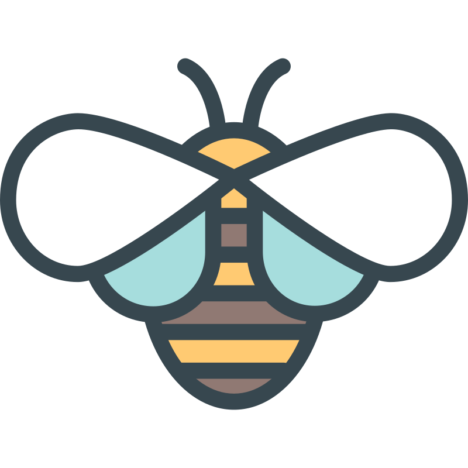

 

# 💼 My Portfolio

Welcome to my personal portfolio website!

This project showcases my skills, projects, and experience as a developer. It highlights selected work, technologies I use, and ways to contact me.

## 🛠️ Technologies Used

  

## 📂 Featured Projects

- **Movie DC** – Explore trending movies, search for titles, and dive into detailed movie info.
- **LMS SaaS App** (Trenavo AI) – delivers personalized learning sessions where users can customize topics, voice tone, and duration, and track their progress through profiles and bookmarks.

## 📬 Contact Me

---

⭐ If you like this project, give it a star!

## Visit my website

[mohammad-alasli-portfolio](https://mohammad-alasli-portfolio.netlify.app/)
